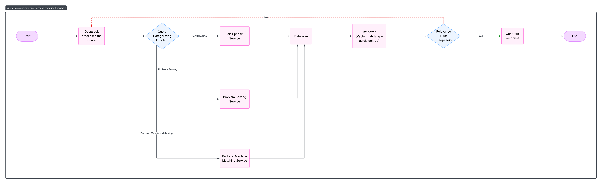

# 🚀 Quick Start Guide — PartSelect Chatbot

Welcome to the **PartSelect Chatbot** — a sleek React-based AI assistant tailored for appliance troubleshooting and part discovery, powered by your custom backend API.

---

## 🧱 ARCHITECTURE



**Frontend:** React (Vite)  
**Backend:** Python (Flask) + ChromaDB + DeepSeek API  
**LLM:** DeepSeek + Vector Search (SentenceTransformers)

---

## 🌐 FRONTEND

### Prerequisites

Ensure the following are installed:

- **Node.js** v18+
- Backend server running at `http://localhost:5001`

### Installation

1. **Navigate to the project folder:**

```bash
cd partselect-chatbot
```

2. **Install dependencies:**

```bash
npm install
```

### ▶Running the Frontend

```bash
npm run dev
```

Open browser at: `http://localhost:3000`

---

## 🖥️ BACKEND

### Prerequisites

Ensure the following are installed:

- **Python** 3.12+
- ChromaDB and virtual environment support

### Installation

1. **Navigate to the backend folder:**

```bash
cd backend
```

2. **Set up virtual environment and install dependencies:**

```bash
python -m venv venv
```

```bash
venv\Scripts\activate  # On Windows
# or
source venv/bin/activate  # On Mac/Linux
```

```bash
pip install -r requirements.txt
```

3. **Create `.env` file and fill it with credentials:**

```bash
touch .env
```

Inside `.env`:

```env
DEEPSEEK_API_KEY=your_deepseek_api_key_here
DEEPSEEK_BASE_URL=https://api.deepseek.com/v1
```

### Running the Backend

```bash
python app/__init__.py
```

---

## 🧠 Data Setup & Vector Database

### Refreshing ChromaDB & Lookups

1. **Scrape parts and models:**

```bash
python scripts/scraper_model.py
python scripts/scrapper_page.py
```

2. **Ingest scraped data into ChromaDB:**

```bash
python chroma_db/ingest_models.py
python chroma_db/parts.py
```

3. **Create JSON lookup maps:**

```bash
python scripts/save_model_part_map.py
python scripts/save_part_id_model.py
```

---

